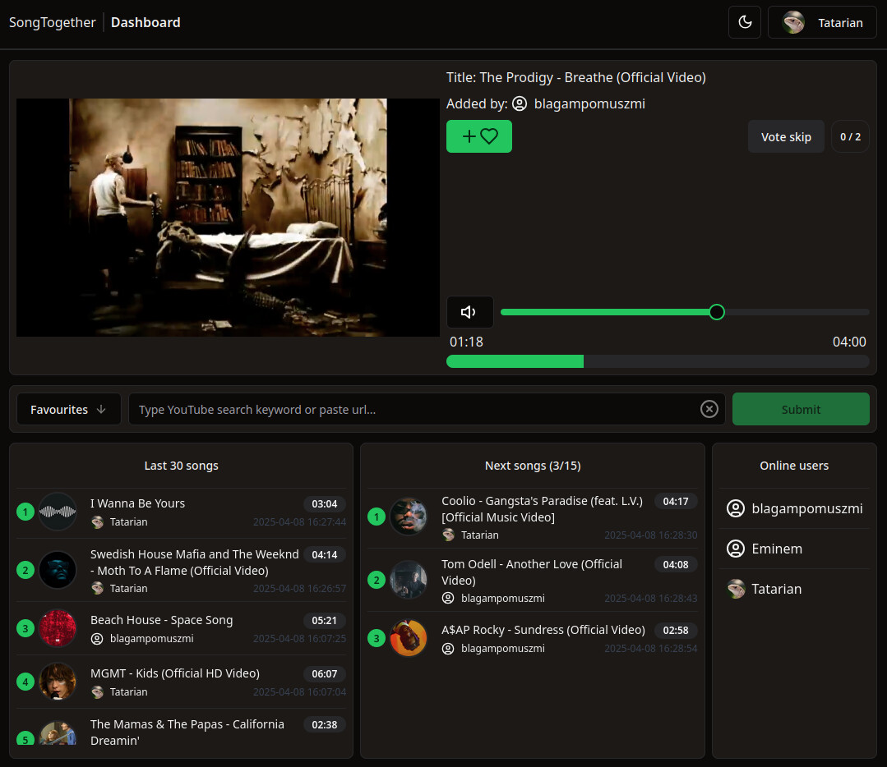
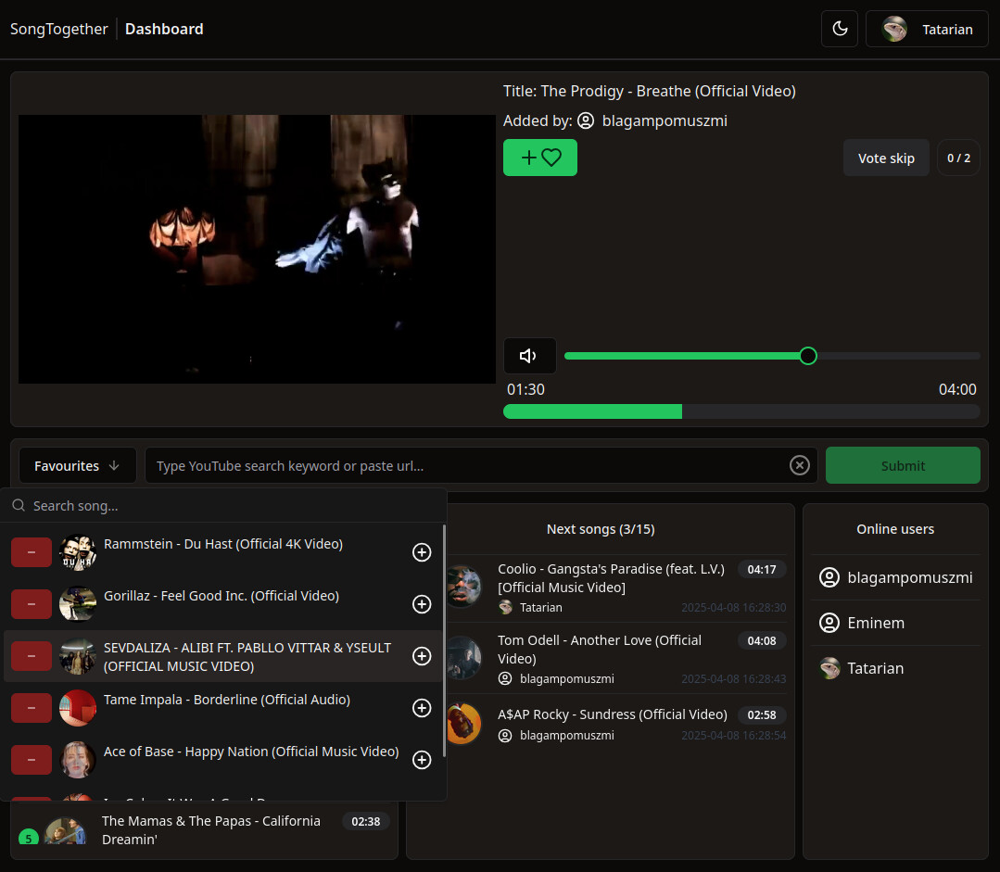
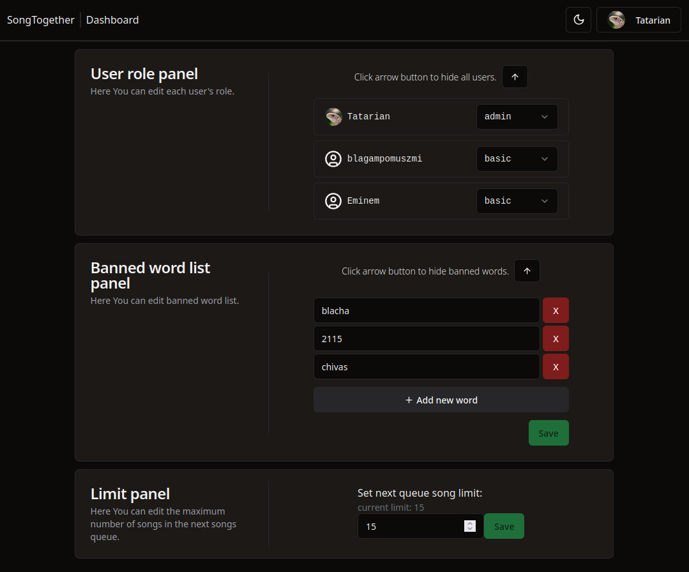
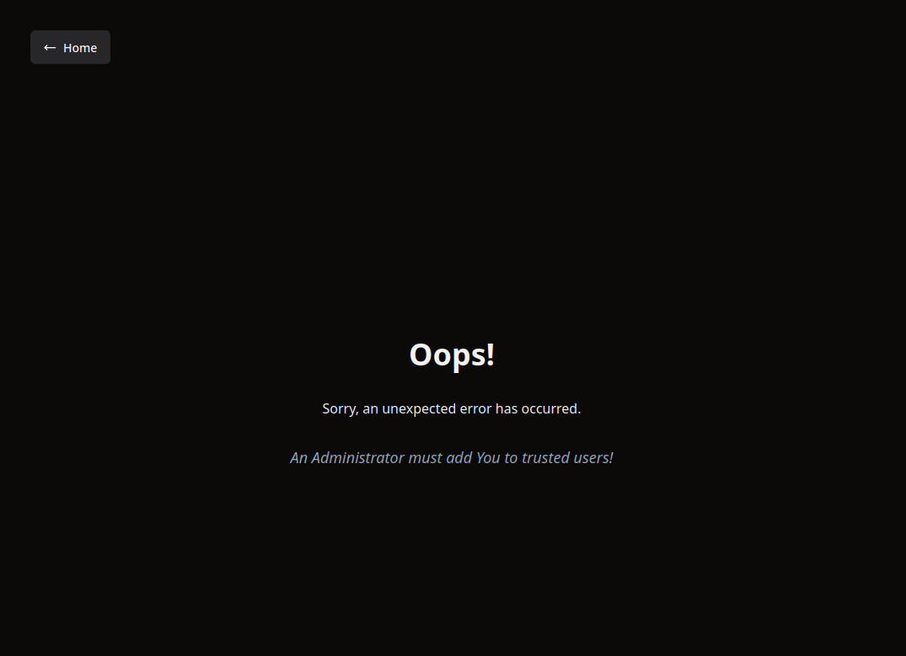

# Backend for SongTogether

SongTogether is a web application that allows users to listen to music simultaneously.

### Dashboard:


### Favourites list:


### Query search:


### Admin panel:


### User without required role:



## Features

### User Features
- **Discord OAuth**: Login using Discord credentials.
- **Real-Time Sync**: Listen to the same song with others in a room.
- **Search Songs**: Search songs by keywords or simply provide song's YouTube URL.
- **Favorites**: Save favorite songs for quick access.
- **Queue Management**: Add songs to a shared queue
- **Vote to Skip**: Democratic system of skipping songs.


### Admin Features
- **Role Management**: Assign roles to users.
- **Song Limits**: Set maximum songs in queue.
- **Banned Words Filter**: Block songs with prohibited keywords in titles.

## Tech Stack

- **Programming Language**: TypeScript
- **Backend**: Node.js + Express  
	- FFmpeg
	- node-ytdl-core
- **Database**: Sqlite 
- **Auth**: Discord OAuth2 with cookie session
- **Real-Time Communication**: Socket.io

## Example of backend's `.env` file 

```bash
# Host
HOST_URL=''

# Port
PORT=3000

# Frontend URL
CLIENT_URL=''

# YouTube API Key
YOUTUBE_API_KEY=''

# Discord OAuth
DISCORD_CLIENT_ID=''
DISCORD_CLIENT_SECRET=''

# SSL Certificate location
SSL_KEY=
SSL_CRT=

# Admin username
OWNER_DISCORD_USERNAME=''
```

## Additional Information
- [yt-dlp](https://github.com/yt-dlp/yt-dlp) has to be install on machine ([node-ytdl-core](https://github.com/fent/node-ytdl-core#readme) had problems with 403 status response)
 - Additional proxy layer may be required because YouTube tends to block some IP ranges
